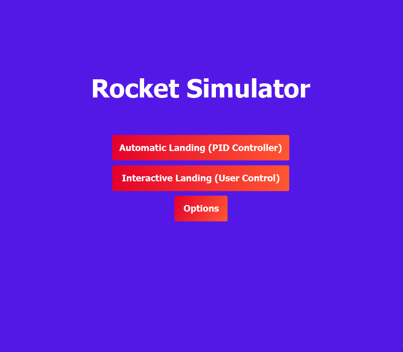
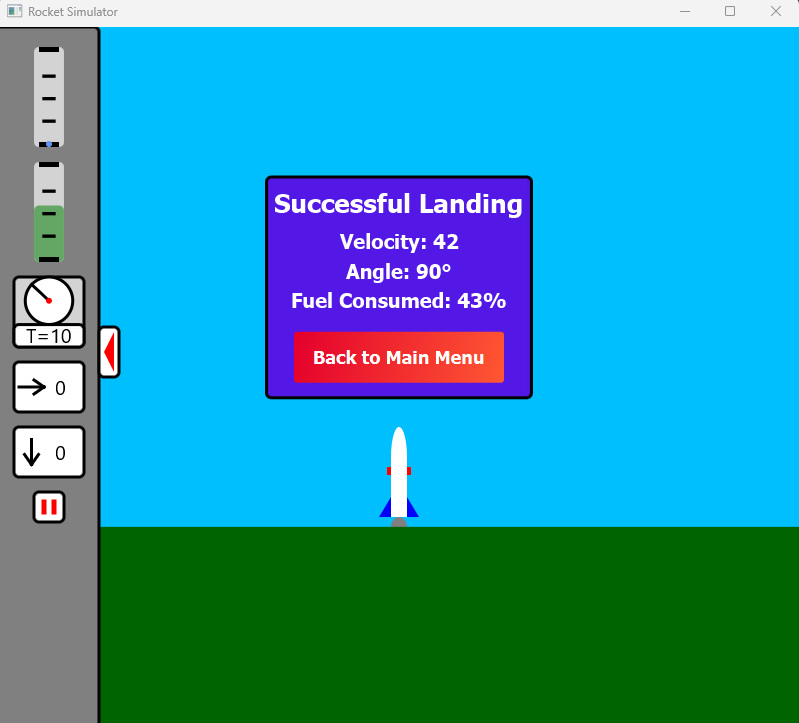

# Rocket Simulator
&nbsp;&nbsp;&nbsp;&nbsp;&nbsp;&nbsp;&nbsp;&nbsp;&nbsp;&nbsp;&nbsp;&nbsp;&nbsp;&nbsp;&nbsp;&nbsp;&nbsp;&nbsp;&nbsp;&nbsp;&nbsp;&nbsp;&nbsp;&nbsp; 

&nbsp;&nbsp;&nbsp;&nbsp;&nbsp;&nbsp;&nbsp;&nbsp;&nbsp;&nbsp;&nbsp;&nbsp;&nbsp;&nbsp;&nbsp;&nbsp;&nbsp;&nbsp;&nbsp;&nbsp;&nbsp;&nbsp;&nbsp;&nbsp; 

Welcome to the Rocket Simulator! This project simulates rocket landings using different control strategies, including PID control and user-controlled maneuvers.

## Table of Contents

- [Introduction](#introduction)
- [Features](#features)
- [Installation](#installation)
- [Usage](#usage)
- [Controls](#controls)
- [Contributing](#contributing)

## Introduction

The Rocket Simulator is a Java-based application that simulates the landing of rockets. It includes both automatic and manual control modes, allowing users to experiment with different control strategies and observe their effects on rocket landings.

## Features

- **Automatic Landing**: Uses a PID controller to manage the rocket's descent and landing.
- **Manual Control**: Allows users to control the rocket's orientation and thrust manually.
- **Real-time Simulation**: Visualizes the rocket's trajectory and landing in real-time.
- **Customizable Parameters**: Adjust rocket parameters such as initial fuel, speed, and altitude.

## Installation

To run the Rocket Simulator, you need to have Java and Maven installed on your system.

1. **Clone the Repository**:

   ```bash
   git clone https://github.com/xavii-p/RocketSim.git
   cd RocketSim
   ```

2. **Use Maven to build the project**:
   _Navigate to project root directory i.e. /RocketSim_

   ```bash
   mvn clean compile
   ```

3. **Start the simulation using Maven:**:
   
   ```bash
   mvn javafx:run
   ```

## Usage

- **Automatic Landing**: Select the automatic landing option to see the PID-controlled rocket in action. Feel free to adjust the PID parameters (kP, kI, kD) to see how they affect the rocket's landing in the _Rocket.java_ file.
- **Manual Control**: Use the keyboard (W, A, D) to control the rocket's thrust and orientation.

## Controls

- **W**: Increase thrust
- **A**: Rotate left
- **D**: Rotate right
- **I**: Display current target angle and direction

## Contributing

Contributions are welcome! Please fork the repository and submit a pull request for any improvements or bug fixes.

1. Fork the repository
2. Create a new branch (`git checkout -b feature-branch`)
3. Commit your changes (`git commit -am 'Add new feature'`)
4. Push to the branch (`git push origin feature-branch`)
5. Create a new Pull Request
